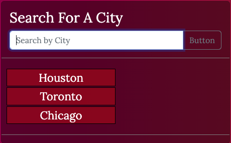
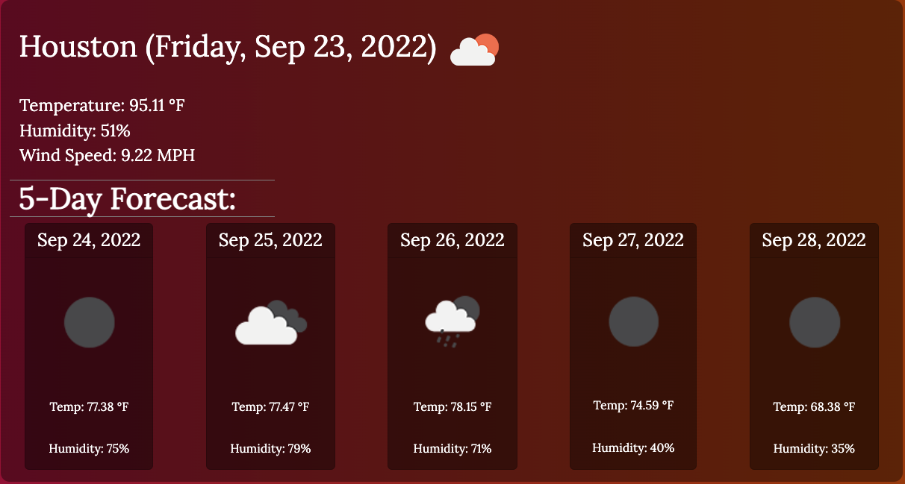

# Weather API Project

This project was an exercise in using API's to construct a 5 day weather forecast. This was built using

- MomentJS
- JQuery
- Bootstrap

for the Rice University Coding Bootcamp.

## Directions

In the search bar, type out a valid city, and the forecast for the next 5 days will pop up. There is also a list that is generated based upon recent searches.

The 5 day forecast is featured prominently underneath the current day's weather.

